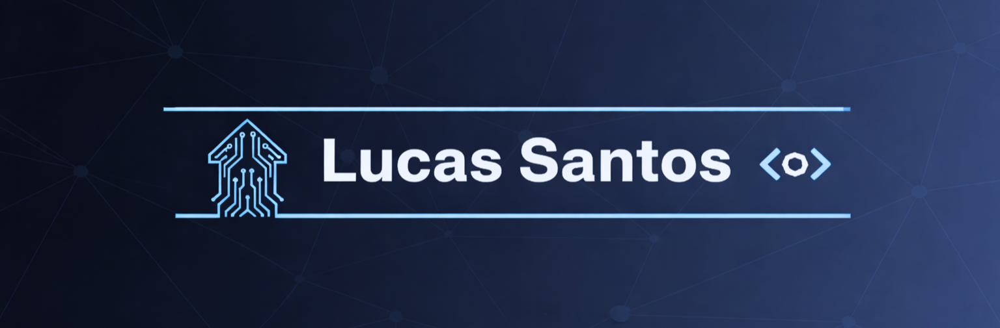

  

<h1 align="center">Lucas de Oliveira Santos</h1>

  Desenvolvedor em formação • Técnico em Desenvolvimento de Sistemas

---

## 🧑‍💻 Sobre Mim
👋 Olá! Meu nome é Lucas. Sou Técnico em Desenvolvimento de Sistemas e tenho interesse em programação e tecnologia.  
Estou construindo minhas primeiras experiências na área e evoluindo gradualmente.

---

## ⚙️ Tecnologias

  
  
  
  
  
  
  
  
  
  
  
  

---

## 🛠️ Ferramentas

  
  
  
  
  

---

## 📫 Contato

  
  

